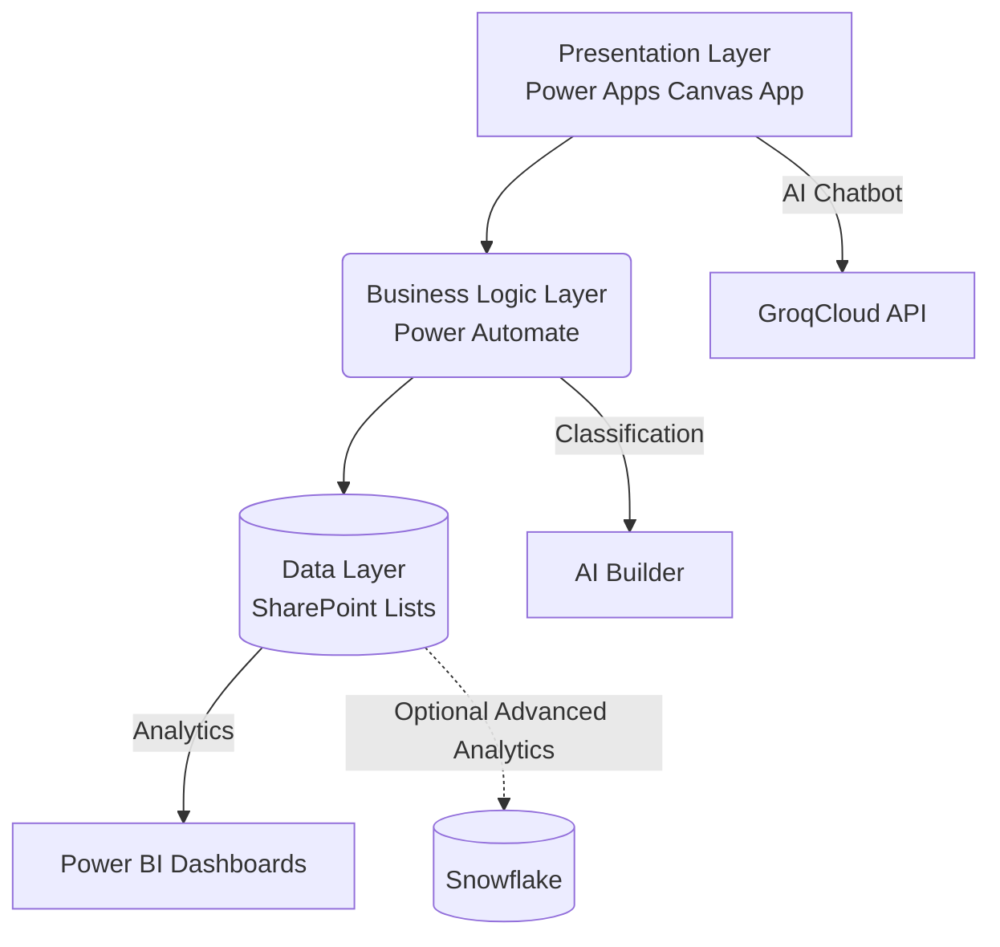

  <h1>Campus Connect</h1>
  
<strong>Enterprise Smart Campus Management Platform</strong>

  
<i>Microsoft Power Platform • AI-Powered • Low-Code • Cloud-Native</i>

 

## Table of Contents
- [Project Overview](#project-overview)
- [Problem Statement](#problem-statement)
- [Proposed Solution](#proposed-solution)
- [Core Modules & Features](#core-modules--features)
- [System Architecture](#system-architecture)
- [Technologies Used](#technologies-used)
- [AI & Analytics Integration](#ai--analytics-integration)
- [Project Scope](#project-scope)
- [Future Enhancements](#future-enhancements)
- [Conclusion](#conclusion)

---

## Project Overview

**Campus Connect** is an enterprise-grade, low-code smart campus management platform built natively on the Microsoft Power Platform ecosystem. Designed to modernize how educational institutions deliver student services, the platform centralizes academic tracking, complaint resolution, event management, leave workflows, placement support, and AI-powered student assistance into a single unified interface accessible via web and mobile devices.

By leveraging **Power Apps** for frontend delivery, **SharePoint** as a structured data backbone, **Power Automate** for end-to-end workflow automation, **Power BI** for institutional analytics, and **AI Builder with Groq AI** for intelligent processing, Campus Connect eliminates the fragmented, manual processes that hinder student experience and administrative efficiency in most colleges today.

---

## Problem Statement

The vast majority of colleges continue to manage critical student services through disconnected legacy systems or entirely manual, paper-based processes. 

- **Fragmented Portals**: Students navigate multiple portals—or none at all—to access attendance records, academic results, fee status, and study materials.
- **Inefficient Issue Resolution**: Administrators handle an overwhelming volume of requests through email chains, physical registers, and verbal communication, resulting in slow resolution times, zero visibility into pending issues, and recurring data errors.
- **Information Silos**: Communication gaps between students and institutional departments lead to a lack of data-driven insights for institutional decision-making and quality improvement.

The cumulative impact is a degraded student experience, inefficient administration, and a significant gap between what modern higher education institutions should deliver and what students actually receive.

---

## Proposed Solution

Campus Connect addresses the campus management crisis through a centralized, low-code platform built entirely on Microsoft Power Platform—a strategic choice that enables rapid deployment, seamless integration with institutional Microsoft 365 environments, and zero dependency on external servers or complex infrastructure.

### The Six Core Pillars:
1. **Unified Student Experience**: A personalized Power Apps canvas application acts as the single window for academics, complaints, leave, events, placements, and AI chat support.
2. **Intelligent Complaint Management**: AI Builder classifies incoming complaints by category, predicts priority levels, and detects duplicates before routing them through automated Power Automate workflows.
3. **Workflow Automation**: Handled by Power Automate for leave approvals, event notifications, and complaint routing, eliminating manual intervention.
4. **Data-Driven Administration**: Power BI dashboards provide real-time analytics on complaint resolution, academic health, and event participation.
5. **AI-Powered Student Chatbot**: A Groq AI-powered chatbot provides sub-second responses to student queries directly within the interface.
6. **Cloud-Native Data Architecture**: SharePoint Lists provide seamless integration, role-based access control, and built-in versioning.

---

## Core Modules & Features

### Student Academic Dashboard
- Real-time display of CGPA, attendance percentage, current semester, and active backlogs.
- Fee status tracking with due-date alerts.
- Quick access tiles for all platform modules.

### Complaint Management System
- Structured complaint submission with category selection (academic, infrastructure, administrative, etc.).
- Live complaint status tracking from submission to resolution.
- AI Builder-powered automatic categorization, priority prediction, and duplicate detection.

### Event & Notice Management
- Upcoming college events calendar with registration support.
- Push notification dispatch for new announcements, deadlines, and emergencies.
- Academic notice board with date-stamped postings and read-receipt tracking.

### Leave Management
- Digital leave application submission with reason, duration, and supporting document upload.
- Multi-level approval and rejection workflow with automated email notifications.

### Placement & Internship Module
- Company drive listings with eligibility criteria, timelines, and registration links.
- CGPA-based automatic eligibility filtering to display only applicable opportunities.

### Study Material Repository
- Faculty-side upload interface for notes, slides, and reference materials.
- Subject-wise and semester-wise filtering for fast resource discovery.

---

## System Architecture

Campus Connect follows a **Three-Tier Architecture** pattern natively aligned with the Microsoft Power Platform stack, ensuring clean separation of concerns and seamless data flow:

1. **Presentation Layer (Tier 1)**: Power Apps Canvas Application delivering role-scoped views for Students and Admins. Fully responsive layout.
2. **Business Logic Layer (Tier 2)**: Power Automate cloud flows triggered by SharePoint events. Handles complaint routing, leave approvals, event notifications, and placement filtering.
3. **Data Layer (Tier 3)**: Structured institutional data is stored across purpose-specific SharePoint Lists (Students, Complaints, Events, Leaves, Placements, Study Materials, Notices). Optional Snowflake integration for historical reporting.

---

## Technologies Used

| Layer | Technology / Tool |
| :--- | :--- |
| **Frontend** | Microsoft Power Apps (Canvas Application) |
| **Backend** | Microsoft SharePoint Lists |
| **Automation** | Microsoft Power Automate (Workflow Engine) |
| **Analytics** | Microsoft Power BI (Institutional Dashboards) |
| **AI / ML** | AI Builder (Classification, Priority, Duplicate Detection) |
| **Chatbot** | Groq AI / GroqCloud API (LLM-Powered Student Chatbot) |
| **Auth & IAM** | Microsoft Entra ID / Azure AD (RBAC, SSO) |
| **Notifications**| Power Automate + SharePoint Alerts + Email/Push |

---

## AI & Analytics Integration

- **AI Builder (Custom Model)**: Trained on institutional complaint history to classify type (academic, infrastructure, administrative), predict urgency, and surface duplicates before routing.
- **Groq AI (Student Chatbot)**: Powers the campus AI assistant using Groq's ultra-fast LLM inference engine for real-time, conversational student support (handling academic queries, complaint intake, policy FAQs, etc.) with sub-second response times.
- **Power BI (Institutional Analytics)**: Connected directly to SharePoint Lists to deliver dashboards on complaint SLAs, academic health, placement statistics, and leave utilization with row-level security.

---

## Project Scope

### In Scope
- Student academic dashboard (CGPA, attendance, fee status)
- AI-powered complaint management
- Leave application & multi-level approval workflow
- Event management & push notifications
- Academic notice board with announcement dispatch
- Placement module with CGPA filtering
- Study material repository
- AI chatbot assistant for student queries
- Power BI institutional analytics dashboards
- Role-based access control (RBAC)

### Out of Scope
- Multi-college or multi-institution deployment support
- Enterprise ERP integration (SAP, Oracle, Tally)
- Blockchain-based certificate issuance
- External job board integration
- Payment gateway for fee collection

---

## Future Enhancements
- **Multi-Campus Rollout**: Extend the platform architecture to support multiple institutions under a single console.
- **Biometric & IoT Attendance**: Integrate with biometric hardware for real-time attendance tracking.
- **Predictive Academic Analytics**: Leverage AI Builder regression models to identify at-risk students based on declining CGPA and attendance.
- **Native Mobile Application**: Dedicated Android/iOS applications using React Native or Power Apps Mobile.
- **ERP & SIS Integration**: Bidirectional data sync with enterprise HR, financial, and academic records.

---

## Conclusion
Campus Connect demonstrates that the Microsoft Power Platform ecosystem is fully capable of delivering an enterprise-grade, AI-augmented campus management solution without the cost and complexity of custom software development. By consolidating services that students and administrators use daily into one coherent, automated platform, Campus Connect transforms institutional operations and elevates the student experience to the standard that modern higher education demands.
